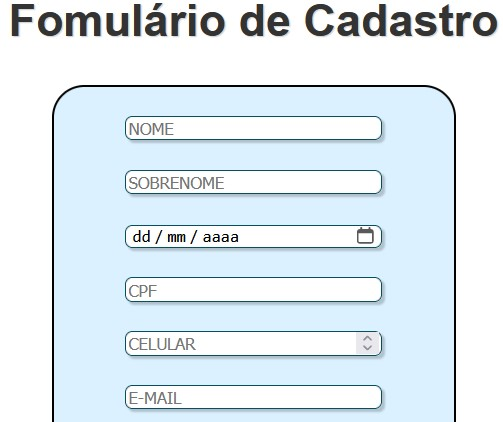

# Formulário_de_Cadastro
Fomúlario de Cadastro da atividade de Programação Web. 
Ensino Médio Téc. Colégio Marista Ir. Acácio.


## Sobre o Projeto
Nesta versão do projeto foi adicionado o campo de ```Confirmação de Email``` e funcionalidade de verificação de email, preenchimento dos campos do CEP e removido a verificação do CPF para a implementação de tal futuramente.

Foi pesquisado sites de e-commerces para a comparação de campos e funcionalidades, assim podendo identificar possíveis diferenças, os sites observados foram: 

 1- [Terabyteshop](https://www.terabyteshop.com.br/Cadastro.obj)  
 2- [Amazon](https://www.amazon.com.br/ap/register?showRememberMe=true&openid.pape.max_auth_age=3600&openid.identity=http%3A%2F%2Fspecs.openid.net%2Fauth%2F2.0%2Fidentifier_select&siteState=clientContext%3D000-0000000-0000000%2CsourceUrl%3Dhttps%253A%252F%252Fwww.amazon.com.br%252Fgc%252Fredeem%2Csignature%3DEk4KGQJwzfzbOlTPFarDOxRRLCAj3D&marketPlaceId=A2Q3Y263D00KWC&pageId=amzn_gcfront_v2_br&mobileBrowserWeblabTreatment=C&openid.return_to=https%3A%2F%2Fwww.amazon.com.br%2Fgc%2Fredeem&prevRID=QCC8MMNS2BAPS9VV19FJ&openid.assoc_handle=amzn_gcfront_v2_br&openid.mode=checkid_setup&desktopBrowserWeblabTreatment=C&prepopulatedLoginId=&failedSignInCount=0&openid.claimed_id=http%3A%2F%2Fspecs.openid.net%2Fauth%2F2.0%2Fidentifier_select&openid.ns=http%3A%2F%2Fspecs.openid.net%2Fauth%2F2.0)  
 3- [AliExpress](https://login.aliexpress.com/?return_url=http%3A%2F%2Freport.aliexpress.com%2F)

Nos últimos dois sites, foi identificado a pouca quantidades de campos para informações, possívelmente pela razão de que o usuário poderia desistir do cadastro. Porém, foi seguido a tela de cadastro da Terabyte. 

## 🛠️Funcionalidades
O Formulário contém algumas funcionalidades de verificação e confirmação.

1 - Verificação de CEP e consumo da API

        //  Verifica se CEP é válido
            const eNumero = (numero) => /^[0-9]+$/.test(numero) 
            const cepValido = (cep) => cep.length == 8 && eNumero(cep);

        //  Função para consumo de API da VIACEP
            const pesquisarCEP = async() => {
                const url = `https://viacep.com.br/ws/${cep.value}/json/`;
            
                if(cepValido(cep.value)){
                    const dados = await fetch(url); 
                    const address = await dados.json(); 
            
                    if(address.hasOwnProperty('erro')){ 
                        alert("CEP não Encontrado");
                    }else{
                        preencherFormulario(address);
                    }
                }else{
                    alert("CEP Incorreto");
                }
            }
Caso o Cep não seja válido, ele apresentará um ```alert``` de "CEP não Encontrado/Incorreto"

2 - Preenchimento dos Campos ligados ao CEP

        const preencherFormulario = (endereco) => {
                document.getElementById('rua').value = endereco.logradouro;
                document.getElementById('bairro').value = endereco.bairro;
                document.getElementById('cidade').value = endereco.localidade;
                document.getElementById('estado').value = endereco.uf;
            }
Se o CEP for válido, ocorrerá o preenchimento automático dos campos ligados ao CEP.  

3 - Verificação dos Campos e validação de senha/email

        //VERIFICAÇÃO DO PREENCHIMENTO DOS CAMPOS
        function Verifica(event) { 
            event.preventDefault();
        
            let nome              =        document.getElementById('nome').value
            let email             =        document.getElementById('email').value
            let c_email           =        document.getElementById('c_email').value
            let celular           =        document.getElementById('cel').value
            let dataNascimento    =        document.getElementById('data').value
            let cpf               =        document.getElementById('cpf').value
            let cep               =        document.getElementById('cep').value
            let rua               =        document.getElementById('rua').value
            let numero            =        document.getElementById('numero').value
            let complemento       =        document.getElementById('complemento').value
            let bairro            =        document.getElementById('bairro').value
            let cidade            =        document.getElementById('cidade').value
            let estado            =        document.getElementById('estado').value
            let senha             =        document.getElementById('senha').value
            let confirmarSenha    =        document.getElementById('senha2').value


            if (!nome || !email || !c_email || !celular || !dataNascimento || !cpf || !cep || !rua || !numero || !bairro || !cidade || !estado || !senha || !confirmarSenha) {
            alert("Preencha todos os campos corretamente!")
            //} else if (!validaCPF(cpf)) {
            //  alert("CPF inválido.")
            //  return false
            } else if (senha != confirmarSenha) {
            alert("As senhas não são iguais.")
            } else if (email != c_email) {
            alert("E-mails diferentes.")
            } else {
            alert("Cadastro realizado com sucesso!")
            window.location.href = "sucesso.html"
            return true
            }
        }

Aqui é feito a verificação dos campos e confirmação do email e da senha. Caso, haja alguma diferença nos dois campos de senha e email, o JS irá retornar um ```alert("As senhas não são iguais.")```. Também, se faltar algo a ser preenchido, aparecerá ```alert("Preencha todos os campos corretamente!")```. Se tudo estiver nos conformes, o usuário será redirecionado para a página de ```sucesso.html```.  

### Cadastro
É necessário Preencher todas as informações.
- :heavy_check_mark: Contém: 
- Vereficador de campos; é necessário preencher todos os campos corretamente;
- Verificador de CEP; Caso, não queira usar seu CEP use o site: [4devsferramentasoline](https://www.4devs.com.br/gerador_de_cep) para gerar um CEP válido.
OBS: Use o CEP sem pontuação.
- Campos de Confirmação de senhas e email: Nesses campos é necessário que a senha e email estejam iguais.
No final, você terá um resultado parecido com esse...


### Sucesso

Após realizado o cadastro, você parará na página de Sucesso!


## 🖥Tecnologias Utilizadas
- :heavy_check_mark: [HTML5]
- :heavy_check_mark: [CSS3]
- :heavy_check_mark: [JS]
- :heavy_check_mark: [GIT]

## Objetivos Futuros
Após essa atividade de Programação Web, um dos objetivos será a melhoria desse projeto, tentando replicar funcionalidades/ações da tela de cadastro da Terabyteshop.

## Autor
- Caio Estevão -
  [github.com](https://github.com/Caioestevao1000)
